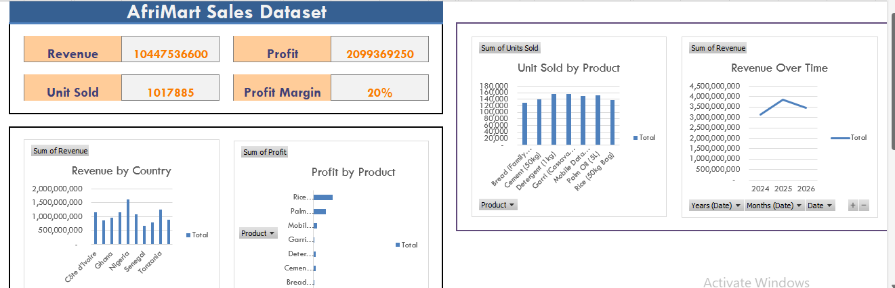

# AfriMart_Sales_Dataset_Dashboard
## Project Overview
This project analyzes data from AfriMart. Using Microsoft Excel, Pivot Tables and a dashboard were created to track revenue performance.
This project was created as part of a data analysis portfolio to demonstrate Excel dashboarding, data summarization, and business insight skills 

---
## Business Question Answered
- What is the total revenue, profit, and units sold?
- Which countries generate the highest revenue?
- Which products are the most profitable?
- How does revenue change overtime?
- Which products perform best in different regions?

---
## Key KPIs
- Total Revenue
- Total Profit
- Total Units Sold
- Profit Margin

---
## Tools Used
- Microsoft Excel
- Pivot Tables
- Pivot Charts
- Excel Slicers
- Dashboard Design Techniques

---
## Dashboard Preview

---
## Key Insights
- Nigeria contributed the highest share of total revenue.
- Some products recorded high sales volume but lower profit margins.
- Revenue trends show consistent growht over time.
- Product performance varies significantly by country.

---
Files in this Repository
- [Sales Dataset](AfriMart_Sales_Dataset (1)_RoseOkorie.xlsx)
- [Dashboard](AfriMart_Sales_Dashboard.png)
- README.md

---
## Conclusion

This project demonstrates how raw sales data can be transformed into clear, interactive dashboards that support data-driven business decisions. It highlights strong Excel fundamentals, analytical thinking, and professional project documentation.
